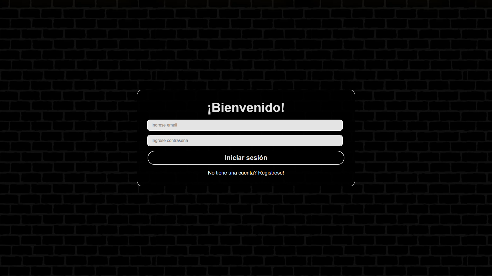
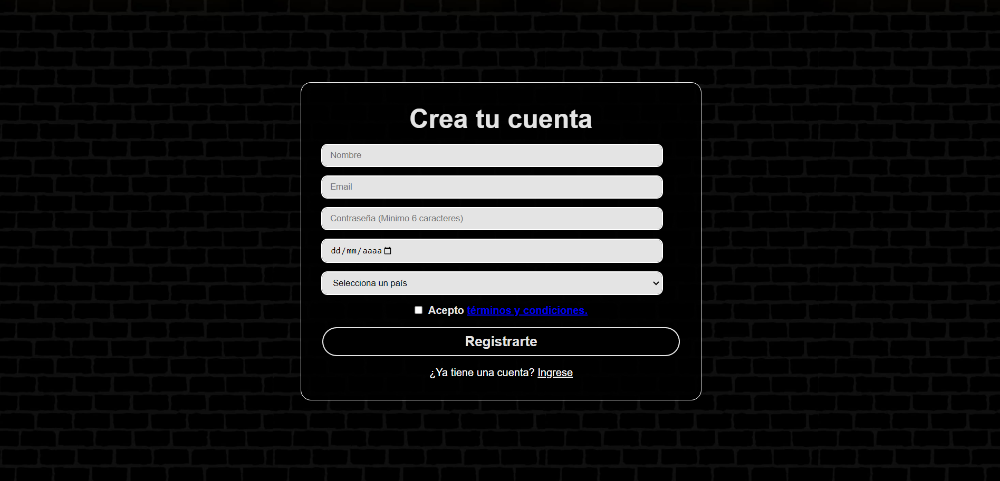
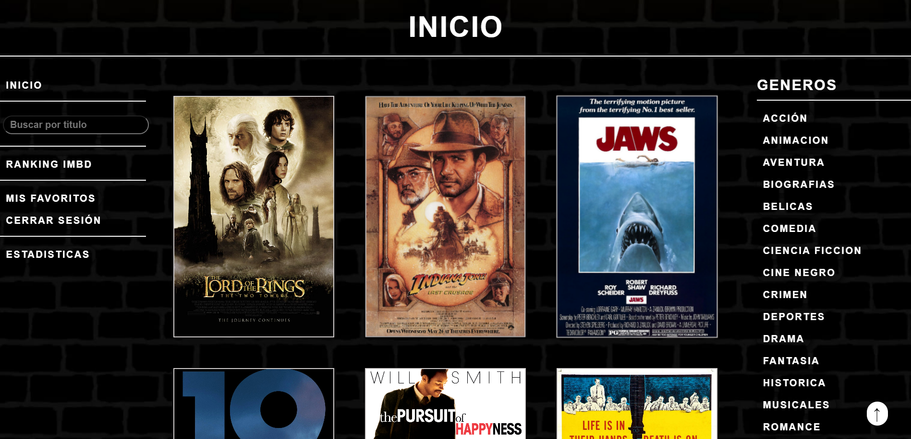
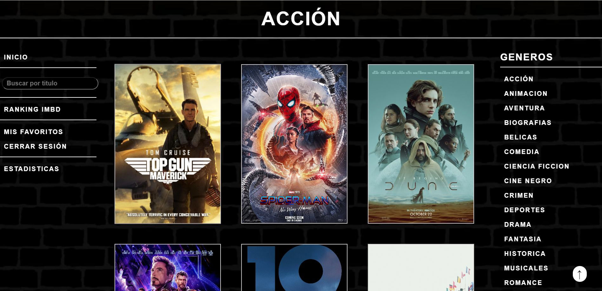
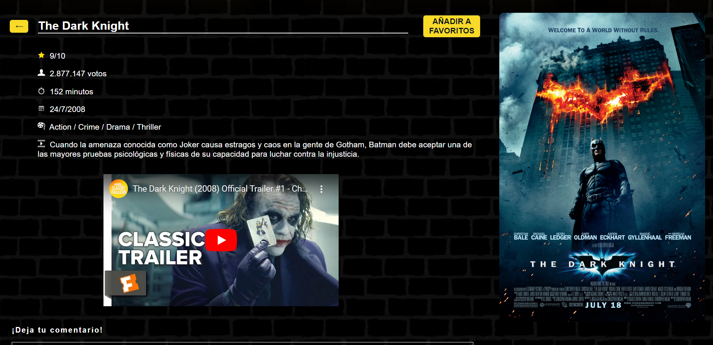
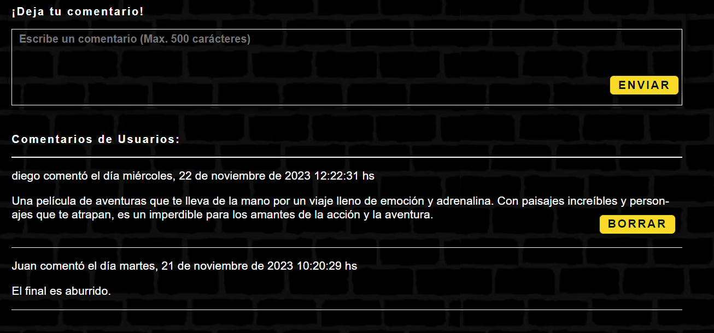
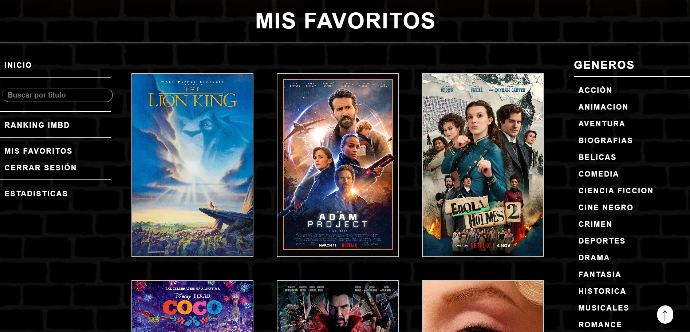
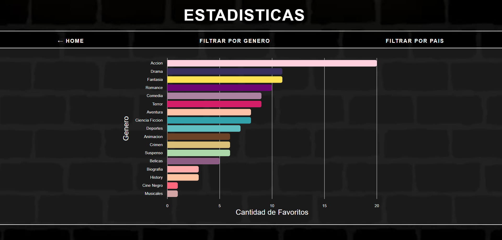
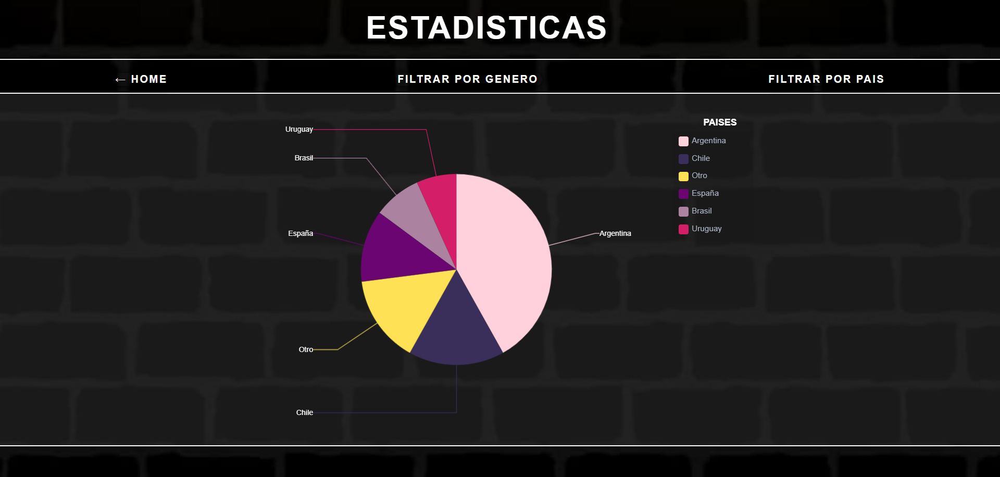

# The Movies Wall (Proyecto Final Universidad Tecnológica Nacional) 

This project is a web application that allows users to explore movies, create favorite lists, comment on movies, and view real-time statistics of user activity built in Spanish as a final project for UTN University.

## Technologies Used

## Installation

To get a local copy up and running, follow these simple steps:

Install Node.js (https://nodejs.org/en/download/current) and Angular CLI (npm install -g @angular/cli)

Run npm install to install the libraries.

Use ng serve to launch the program in Angular (Here you can see the port used to view the web app).

(If there is a problem running ng serve, execute Set-ExecutionPolicy -ExecutionPolicy RemoteSigned -Scope CurrentUser and then run ng serve)

In another terminal, install JSON server: npm install -g json-server

Run the command npm run backend.

Open the link provided by ng serve.

## Screenshots

### Login

### Sign Up

### Home

### Action Category

### Movie Example

### Comments on Movie

### Your Favorite Movies List

### Live Stats of Your Users

